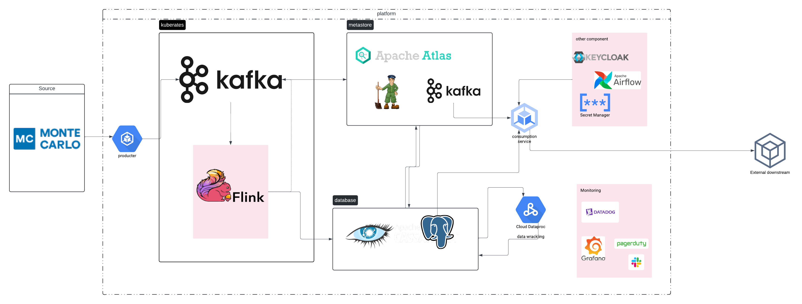

## Architecture for Real-Time Metadata Ingestion and Consumption

### Overview

This architecture supports real-time metadata ingestion and consumption, integrating various components such as Apache Kafka, Flink, Apache Atlas, PostgreSQL, Cassandra, and additional services for security, monitoring, and orchestration. The goal is to ensure efficient, scalable, and secure processing of metadata events from sources like Monte Carlo to external downstream systems.

### Components

1. **Event Source**
   - **Monte Carlo**: Data observability tool that detects data reliability issues and generates events.

2. **Data Streaming Platform**
   - **Apache Kafka**: Distributed streaming platform used for building real-time data pipelines and streaming applications.

3. **Ingestion Service**
   - **Flink**: Stream processing framework used to process and transform data streams from Kafka.

4. **Metadata Store**
   - **Apache Atlas**: Metadata management and governance system for managing metadata.
   - **Cassandra**: NoSQL database used for scalable and high-performance metadata storage.
   - **PostgreSQL**: Relational database used for structured metadata storage.

5. **Consumption Service**
   - Custom service that processes changes in the metadata store and triggers actions or notifications to downstream systems.

6. **Security and Orchestration**
   - **Keycloak**: Open-source identity and access management solution.
   - **Apache Airflow**: Workflow automation and scheduling system.
   - **Secret Manager**: Secure storage for managing sensitive data like API keys and passwords.

7. **Monitoring and Logging**
   - **Prometheus**: Monitoring system and time series database.
   - **Grafana**: Analytics and monitoring platform.
   - **Datadog**: Monitoring and security platform for cloud applications.
   - **PagerDuty**: Incident management and response platform.
   - **Slack**: Communication platform for sending alerts and notifications.

### Architecture Diagram

### Detailed Documentation

#### Metadata Ingestion

1. **Event Source (Monte Carlo)**
   - Monte Carlo detects a data issue and sends an event to Kafka.

2. **Producer (Custom Producer Service)**
   - A custom producer service reads events from Monte Carlo and publishes them to a Kafka topic.

3. **Kafka**
   - Kafka serves as the backbone for streaming data, providing durability and scalability.

4. **Flink**
   - Flink consumes data from Kafka, processes and transforms it (e.g., enrichment, normalization), and writes the processed metadata to the appropriate stores.

#### Metadata Storage

1. **Apache Atlas**
   - Flink writes metadata to Apache Atlas for metadata management and governance.

2. **Cassandra**
   - Flink writes certain types of metadata to Cassandra for scalable and high-performance storage.

3. **PostgreSQL**
   - Flink writes structured metadata to PostgreSQL for relational storage needs.

#### Metadata Consumption

1. **Change Data Capture**
   - Changes in the metadata store are captured (e.g., via Debezium for PostgreSQL) and sent to Kafka.

2. **Consumption Service**
   - The consumption service processes these changes, performs necessary transformations, and forwards metadata to external downstream systems.

3. **External Downstream Systems**
   - Systems that need to consume metadata changes (e.g., for enforcing data access security and compliance).

#### Security and Orchestration

1. **Keycloak**
   - Manages authentication and authorization using OAuth 2.0 and JWT tokens.

2. **Apache Airflow**
   - Orchestrates workflows and schedules tasks for metadata processing.

3. **Secret Manager**
   - Stores and manages sensitive information securely.

#### Monitoring and Logging

1. **Prometheus and Grafana**
   - Prometheus collects metrics, and Grafana visualizes them for monitoring the health and performance of the system.

2. **Datadog**
   - Provides monitoring, security, and analytics capabilities.

3. **PagerDuty**
   - Handles incident management and alerts for system failures or anomalies.

4. **Slack**
   - Sends notifications and alerts to relevant channels for quick response and collaboration.

### Considerations

1. **Scalability**
   - The architecture leverages Kafka and Flink for scalable data streaming and processing.

2. **Security**
   - Keycloak ensures robust authentication and authorization mechanisms.

3. **Multi-Tenancy**
   - Supports both isolated and multi-tenant deployments for flexibility.

4. **Cost Efficiency**
   - Managed services and open-source tools help optimize costs.

5. **Observability**
   - Comprehensive monitoring and logging with Prometheus, Grafana, and Datadog.

### Example Use Case: Monte Carlo to Atlan

1. **Monte Carlo detects a data issue** and sends an event to Kafka.
2. **Custom Producer Service** publishes the event to a Kafka topic.
3. **Flink processes** the event, transforms the metadata, and writes it to **Apache Atlas, Cassandra, and PostgreSQL**.
4. **Changes in metadata** are captured and sent to Kafka.
5. **Consumption Service processes** the changes and sends notifications to **Slack** and other downstream systems.

### Example Use Case: Atlan to Downstream System

1. **Change Data Capture**: Changes in metadata are captured and sent to Kafka.
2. **Consumption Service**: Processes the change and sends it to external downstream systems.
3. **Notifications**: Relevant systems (e.g., Slack, JIRA) are notified about the change.

---

This documentation provides a comprehensive overview of the architecture, ensuring that Atlan can handle real-time metadata ingestion and consumption efficiently and securely.
